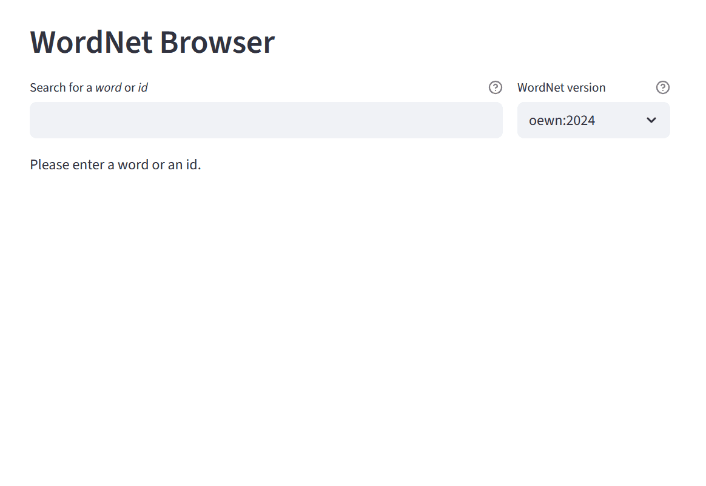
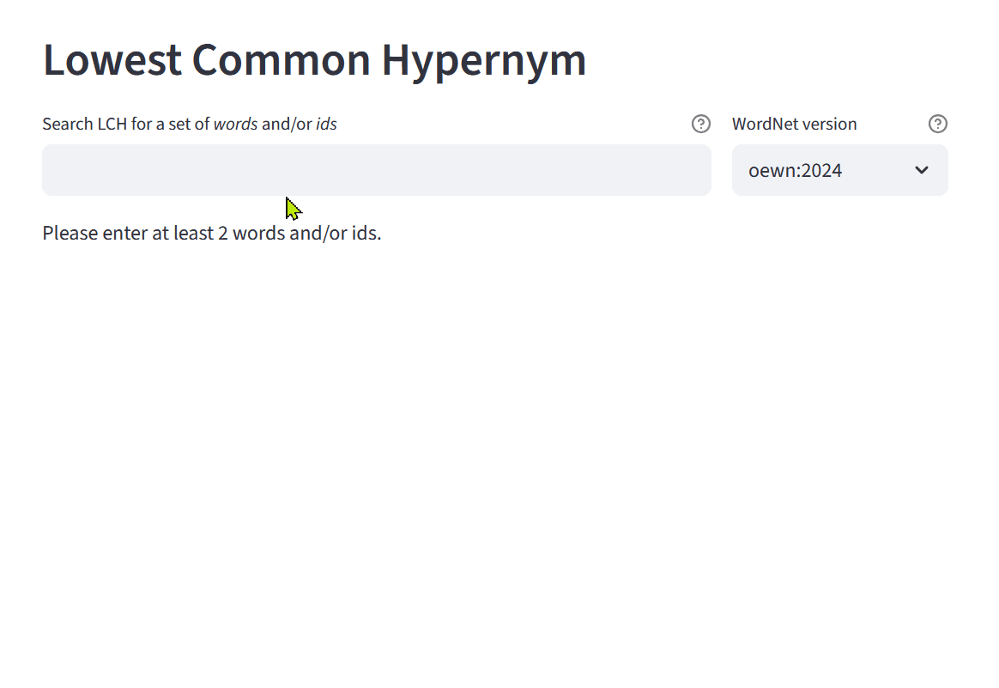

# 🔍 WordNet Browser

An interactive web application for exploring **English WordNet** and **Vietnamese WordNet (VietNet)** — supporting synset lookup, semantic relation traversal, and knowledge graph visualization.

> 🌐 **Live Demo:** [wordnetbrowser-trido.streamlit.app/](https://wordnetbrowser-trido.streamlit.app/)

## 🎬 Demo

<table>
  <tr>
    <th align="center">🔍 WordNet Browser</th>
    <th align="center">🌲 Lowest Common Hypernym</th>
  </tr>
  <tr>
    <td align="center"></td>
    <td align="center"></td>
  </tr>
</table>


---

## ✨ Features

### 🔍 Page 1 — WordNet Browser

| Feature                          | Description                                                                                                                         |
| -------------------------------- | ----------------------------------------------------------------------------------------------------------------------------------- |
| 🔤**Word & ID Search**     | Look up any word or synset ID across multiple WordNet versions                                                                      |
| 🏷️**POS Filtering**      | Browse results by Part-of-Speech: noun, verb, adjective, adverb                                                                     |
| 🌿**First-Level View**     | Quick display of direct semantic relations (hypernym, hyponym, meronym, etc.)                                                       |
| 🌳**Full-Level View**      | Recursive tree expansion of all relation depths with collapsible nodes                                                              |
| 🕸️**Graph View**         | Interactive knowledge graph with auto-switching between hierarchical layout (≤30 nodes) and physics-based force layout (>30 nodes) |
| 🇻🇳**Vietnamese WordNet** | Support for VietNet (food & animal domains) alongside English OEWN                                                                  |

### 🌲 Page 2 — Lowest Common Hypernym (LCH)

| Feature                                    | Description                                                                                                               |
| ------------------------------------------ | ------------------------------------------------------------------------------------------------------------------------- |
| 🔗**Multi-word Input**               | Enter two or more words or synset IDs (comma-separated)                                                                   |
| 🧠**Automatic Sense Disambiguation** | Selects the most semantically similar senses across all input words using brute-force pairwise shortest-path minimization |
| 🌲**LCH Computation**                | Computes the Lowest Common Hypernym across all selected synsets                                                           |
| 🗺️**Path Visualization**           | Renders a unified hierarchical graph showing all shortest paths from the LCH down to each input synset                    |
| 🏷️**Flexible Node Labels**         | Toggle display between lemmas, synset ID, or both                                                                         |

---

## 🏗️ Architecture

This project follows a clean **Adapter + Factory** design pattern, making it straightforward to plug in new WordNet backends without changing the application layer.

```
WordNetBrowserStreamlit/
├── 1_🔍_Browser.py          # Page 1: Synset browser UI
├── pages/
│   └── 2_🌲_LCH.py          # Page 2: Lowest Common Hypernym UI
├── backend/
│   ├── wordnet_api.py        # Abstract interface (WordNetAPI, Synset)
│   ├── wn_adapter.py         # Adapter for the `wn` Python library (OEWN, VietNet XML)
│   ├── vietnet_adapter.py    # Adapter for VietNet CSV format
│   ├── wordnet_factory.py    # Factory — creates the correct backend by version
│   └── utils.py              # Tree rendering, graph conversion & LCH helpers
├── lexicons/                 # Downloaded WordNet data (auto-generated)
├── vietnet/                  # VietNet CSV data (nodes.csv, edges.csv)
├── requirements.txt
└── README.md
```

**Design highlights:**

- `WordNetAPI` and `Synset` are abstract base classes — all backends are interchangeable
- `WordNetFactory` centralizes version configuration; adding a new WordNet requires only one entry
- BFS traversal with configurable `max_depth` and `max_node` prevents runaway queries on large graphs
- LCH sense disambiguation uses brute-force pairwise shortest-path to find the globally optimal sense combination

---

## 🚀 Getting Started

### Prerequisites

- Python 3.9+
- pip

### Installation

```bash
# 1. Clone the repository
git clone https://github.com/TriDo86/WordNetBrowserStreamlit.git
cd WordNetBrowserStreamlit

# 2. Install dependencies
pip install -r requirements.txt

# 3. Run the app
streamlit run "1_🔍_Browser.py"
```

The app will open at `http://localhost:8501`.
On first run, the English WordNet (`oewn:2024`) will be downloaded automatically (~300 MB).

---

## 🗂️ Supported WordNet Versions

| Version                | Language   | Domain  | Source                                    |
| ---------------------- | ---------- | ------- | ----------------------------------------- |
| `oewn:2024`          | English    | General | [Open English WordNet](https://en-word.net/) |
| `vietnet-food:1.0`   | Vietnamese | Food    | VietNet (XML)                             |
| `vietnet-animal:1.0` | Vietnamese | Animal  | VietNet (XML)                             |
| `vinet-food`         | Vietnamese | Food    | VietNet (CSV)                             |

---

## 🔧 How to Add a New WordNet Backend

1. Implement the `WordNetAPI` and `Synset` abstract interfaces in a new adapter file under `backend/`
2. Register the new version in `WordNetFactory.WORDNETS` in `wordnet_factory.py`
3. That's it — the UI layer requires no changes

```python
# wordnet_factory.py
WORDNETS = {
    'my-new-wordnet:1.0': {
        'adapter': MyNewAdapter,
        'data_dir': os.path.join(PROJECT_DIR, 'my_data')
    },
    # ... existing entries
}
```

---

## 🛠️ Tech Stack

| Layer               | Technology                                                         |
| ------------------- | ------------------------------------------------------------------ |
| Frontend / App      | [Streamlit](https://streamlit.io/)                                    |
| Graph Visualization | [streamlit-agraph](https://github.com/ChrisDelClea/streamlit-agraph)  |
| English WordNet     | [wn](https://github.com/goodmami/wn) + [OEWN 2024](https://en-word.net/) |
| Vietnamese WordNet  | Custom CSV & XML adapters (VietNet)                                |
| Data Processing     | [pandas](https://pandas.pydata.org/)                                  |
| Language            | Python 3.9+                                                        |

---

## 📖 Usage Examples

**Search by word:**

```
Page 1 → type "dog" → select POS → explore relations (hypernym, hyponym, etc.)
```

**Search by synset ID:**

```
Page 1 → type "oewn-02084071-n" → view definition, lemmas, and graph
```

**Explore the knowledge graph:**

```
Page 1 → select any synset → choose a relation → switch to "Graph View" → interact with the visualization
```

**Find Lowest Common Hypernym:**

```
Page 2 → type "dog, cat" → view auto-selected senses → inspect LCH → explore path graph
```

**LCH with synset IDs (for precise control):**

```
Page 2 → type "oewn-02084071-n, oewn-02085374-n" → view LCH and full path visualization
```

---

## 📚 Related Work

This browser was developed as part of research on cross-lingual semantic alignment between English WordNet and Vietnamese lexical resources.

Related publications:

- *Automatically Translating Nouns in WordNet into Vietnamese using Large Language Models* — FAIR 2025
- *Semantic Labeling of Dictionary Definitions using WordNet and Sentence Embeddings* — VCL 2024

---

## 📄 License

This project is licensed under the MIT License. See [LICENSE](LICENSE) for details.

---

## 🙏 Acknowledgements

- [Open English WordNet](https://en-word.net/) for the English lexical data
- [goodmami/wn](https://github.com/goodmami/wn) for the Python WordNet library
- VietNet research group for Vietnamese WordNet data
